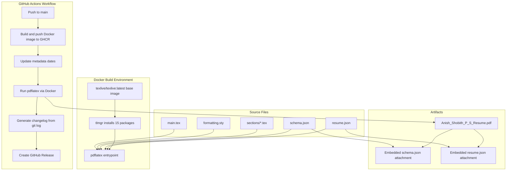
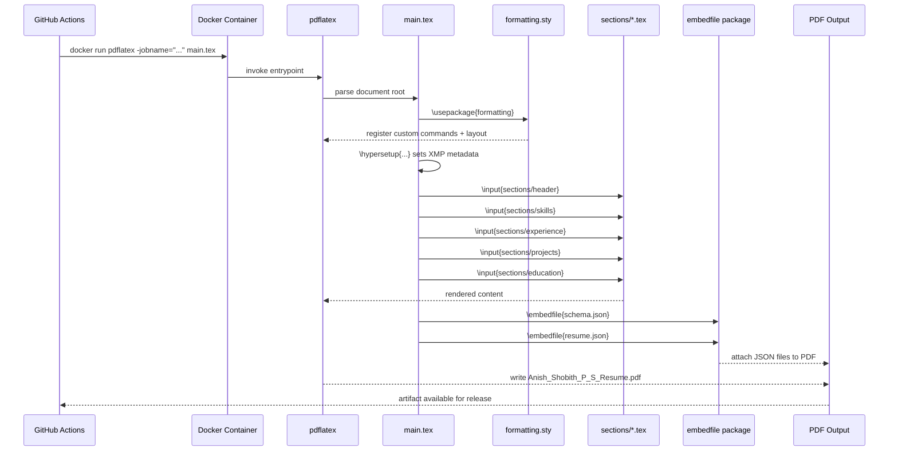
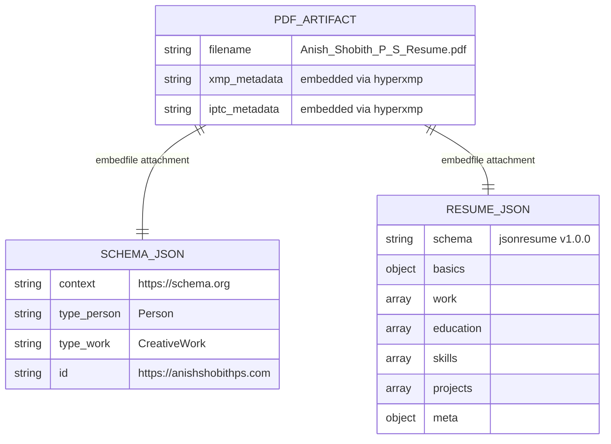

# LaTeX Resume Document System

## Table of Contents

1. [Abstract](#1-abstract)
2. [Introduction](#2-introduction)
   - 2.1 [Key Contributions](#21-key-contributions)
3. [Problem Definition](#3-problem-definition)
4. [System Overview](#4-system-overview)
5. [Design Decisions](#5-design-decisions)
6. [Implementation](#6-implementation)
   - 6.1 [Execution Flow](#61-execution-flow)
   - 6.2 [Core Components](#62-core-components)
   - 6.3 [Data Model](#63-data-model)
   - 6.4 [Interfaces](#64-interfaces)
7. [Evaluation](#7-evaluation)
8. [Limitations](#8-limitations)
9. [Future Work](#9-future-work)
10. [Conclusion](#10-conclusion)

---

## 1. Abstract

This repository implements a document generation system for a professional resume. The source is written in LaTeX, compiled through a containerised build environment, and released automatically via GitHub Actions. The compiled PDF carries metadata in three separate standards: XMP/Dublin Core, Schema.org JSON-LD, and the JSON Resume open standard. I built this because I noticed the PDF viewer title bar showed the word "resume" instead of my name when I embedded the PDF on my website. That small observation sent me down a path of understanding PDF metadata, XMP streams, and ATS parsing. The result is a system that treats the resume as both a human-readable document and a machine-readable data artifact.

---

## 2. Introduction

The project is a single-author resume document system hosted at [github.com/anishshobithps/resume](https://github.com/anishshobithps/resume). It is not a web application, an API, or a library. It is a document pipeline: source files go in, a PDF with embedded structured data comes out.

The whole thing started because of a title bar. I added a `/resume` page to my website and embedded the PDF in a viewer. The viewer showed the word "resume" instead of my name or the document title. I opened twelve browser tabs to understand why, and it turned out my PDF had almost no metadata at all. The `Author`, `Title`, and `Subject` fields were empty. There was no XMP stream. The producer said `pdfTeX` and the creator said `LaTeX with hyperref`, which is the default when you load `hyperref` without configuring it. I decided to fix that, and then kept going much further than I originally intended.

The system has two visible outputs. First, a typeset PDF that a hiring manager reads. Second, that same PDF carries attached JSON files that an ATS parser ingests. Both outputs are produced in one build step, reproducibly, across any machine that runs Docker.

### 2.1 Key Contributions

- A `formatting.sty` package that centralises all layout rules, making content files free of formatting concerns.
- A containerised build step using a pinned TeX Live image, removing environment-specific compilation failures.
- Automated metadata injection for three structured-data standards within a single PDF artifact.
- A GitHub Actions workflow that tags and releases a new PDF on every push to `main`.

---

## 3. Problem Definition

Two separate audiences consume a resume. A person reads the formatted document. A recruiting system parses it programmatically to populate candidate database fields.

A PDF is not a flat document. It is a structured binary format containing, among other things, a document information dictionary (the legacy metadata format) and an XMP stream (the modern standard). The XMP (Extensible Metadata Platform) standard was developed by Adobe and is now the format used by archival systems (PDF/A), enterprise document management platforms, and most modern ATS software. It is built on RDF/XML, which means the metadata is machine-readable in a proper semantic sense: not key-value pairs, but typed, namespaced, linked data.

For a resume, this matters in specific ways. ATS parsing systems like Workday, Greenhouse, and Lever extract text from PDFs and try to identify sections, dates, job titles, and skills. Well-structured metadata helps them get it right. Google and other crawlers that index PDFs use XMP metadata to understand what a document is about. Screen readers use document metadata to describe a file to visually impaired users. And metadata like author, date, and license makes provenance clear.

LaTeX handles the human-readable side well. It produces consistent glyph rendering, handles font encoding, and separates content from layout. What it does not handle out of the box is machine-readable metadata. When I ran `exiftool` on my compiled PDF, the output confirmed the problem:

```
Author                          :
Title                           :
Subject                         :
Creator                         : LaTeX with hyperref
```

No XMP stream at all. No keywords, no language, no rights information, no contact details. The bare minimum for a technically valid PDF.

Modern ATS platforms accept the JSON Resume open standard. Search indexers expect Schema.org annotations. PDF tools look for XMP metadata. No single standard covers all three audiences. I chose to embed all three formats in one file rather than maintain separate documents.

A secondary problem is build reproducibility. LaTeX installations differ across operating systems. A package present on one machine is absent or versioned differently on another. I chose Docker to lock the entire build environment.

A third problem is release friction. Publishing a new PDF manually after every content change is error-prone. I chose continuous delivery via GitHub Actions to automate tagging and uploading.

---

## 4. System Overview

The diagram below shows the full pipeline from source files to release artifact.



*Figure 1: End-to-end build pipeline from source to released PDF.*

The pipeline starts when a push lands on `main`. GitHub Actions builds and pushes the Docker image to GHCR, injects the current date into `resume.json` and `schema.json`, runs pdflatex inside the container, and creates a versioned GitHub Release with the compiled PDF attached.

---

## 5. Design Decisions

**LaTeX over word processors.** LaTeX separates content from layout at the language level. The `formatting.sty` file owns all layout logic. The section files contain only content. Changing the font, spacing, or margin requires editing one file, not hunting through a word processor's style panel. The `XCharter` font was chosen for its T1 encoding support and broad glyph coverage, which matters for PDF/UA compliance. XCharter renders cleanly at small sizes and survives PDF text extraction better than many alternatives.

**The `hypersetup` placement trap.** The two packages that handle PDF metadata are `hyperref` (legacy PDF information dictionary) and `hyperxmp` (the XMP stream extension). Load order is critical: `hyperxmp` must load immediately after `hyperref`. The `\hypersetup` block must live in `main.tex`, not in a `.sty` file. When it is inside a style file, it runs during package loading, before `hyperxmp` has registered its `\AtBeginDocument` hooks. The result is that `hyperxmp` loads without errors, writes no warnings, but produces an empty XMP stream. I hit this exact problem and spent hours grepping log files to diagnose it.

**The `\DTMtoday` and `pdforcid` traps.** I originally included `pdfdate={\DTMtoday}` from the `datetime2` package to embed the compile date. The macro expands at the wrong time inside `\hypersetup` and silently corrupts the entire options block, causing `hyperxmp` to write nothing. Removing it is the correct fix; `hyperxmp` sets the date from the PDF creation timestamp automatically. Separately, I tried adding `pdforcid={}` as a placeholder. It caused a fatal compile error because the `pdforcid` key is only supported in newer versions of `hyperxmp` than what TeX Live 2025 ships.

**The encoding trap.** Using `--` or `\textendash{}` inside metadata string fields breaks silently. These are LaTeX typographic commands that work in the document body but get passed raw to the PDF encoder inside `\hypersetup` values. The encoder interprets them as Windows CP1252 ligatures, producing garbled characters in the metadata. The fix is to use plain ASCII hyphens in all metadata strings and reserve `--` for the visible document body.

**Docker for build isolation.** I originally used `pandoc/latex:latest` as the base image, which ships a minimal frozen subset of TeX Live. The problem is that `tlmgr install` is broken on that image: the installation is frozen and network-restricted, so packages silently fail to install. Switching to `texlive/texlive:latest` gave me a functional `tlmgr`, but introduced a new problem: the default remote repository had moved to 2026, and cross-release updates are not supported. I pinned the repository to the frozen 2025 archive (`https://ftp.math.utah.edu/pub/tex/historic/systems/texlive/2025/tlnet-final`) with an explicit `tlmgr` package list. This means the build on a contributor's laptop produces the same PDF as the one on the CI runner.

**The `attachfile2` dead end.** My first attempt at embedding JSON files used the `attachfile2` package, which creates PDF annotations: clickable paperclip icons attached to a position in the document. It compiles without errors, but the attachment does not appear in the PDF's `EmbeddedFiles` name tree. When you run `exiftool -b -EmbeddedFile`, the output is empty. The file was attached as an annotation object, which is a fundamentally different thing from a name-tree attachment. Most parsers ignore annotations entirely. The correct package is `embedfile`, which writes to the spec-compliant name tree and marks attachments with `afrelationship={/Supplement}`.

**Three metadata standards in one file.** XMP/Dublin Core covers document search tools and PDF viewers. Schema.org JSON-LD covers semantic web indexers. JSON Resume covers ATS platforms. All three are embedded in the compiled PDF. I chose this approach because it requires no separate hosting or API. The PDF is self-contained.

**GitHub Actions for continuous delivery.** The workflow uses `softprops/action-gh-release` to tag releases by run number. Each release includes a generated changelog from `git log` and the PDF file size. I chose this over manual releases because the release notes are reproducible and the PDF is always fresh on `main`.

**Section-based file structure.** Each resume section lives in its own file under `sections/`. The `main.tex` file assembles them with `\input`. This makes it straightforward to add, remove, or reorder sections without touching the root document. The `formatting.sty` defines `\experience`, `\project`, and `\education` commands so the section files read as content declarations, not formatting instructions.

---

## 6. Implementation

### 6.1 Execution Flow

The diagram below shows the call sequence from `pdflatex` invocation to the final PDF.



*Figure 2: Sequence of operations during a single pdflatex compilation pass.*

I noticed that pdflatex writes intermediate files (`.aux`, `.log`, `.out`) during the first pass. The `embedfile` package runs at shipout time, so the JSON attachments are written after all content is typeset. The `-jobname` flag controls the output filename without modifying the source.

### 6.2 Core Components

**`main.tex`**

This is the document root. It sets the document class to `article` at 11pt, imports `formatting.sty`, configures `hypersetup` with all XMP metadata fields (title, author, keywords, copyright, contact, language), and sequences the section inputs. It also calls `\embedfile` twice for the two JSON attachments.

The `\hypersetup` block includes fields from the `hyperxmp` extension: `pdfcontactemail`, `pdfcontacturl`, `pdfcontactaddress`, `pdfcopyright`, and `pdflicenseurl`. These populate IPTC Core fields in the compiled PDF.

**`formatting.sty`**

This file defines all layout behaviour. Key choices:

- `\geometry{a4paper, margin=0.5in}` sets tight margins to fit content on one page.
- `\pagestyle{empty}` removes headers and footers.
- `\pdfgentounicode=1` with `\input{glyphtounicode}` ensures text copy-paste produces readable Unicode, a requirement for PDF/UA.
- `\pdfobjcompresslevel=0` with `\pdfminorversion=7` targets PDF 1.7, which is the minimum version for proper XMP embedding.

Three domain-specific commands are defined: `\experience{role}{org}{location}{date}{items}`, `\project{name}{url}{tech}{items}`, and `\education{degree}{institution}{url}{date}`. Each command handles its own internal spacing via `\vspace{-9pt}` before the itemize block, keeping line density consistent without requiring manual spacing in section files.

**`sections/`**

Five populated content files: `header.tex`, `skills.tex`, `experience.tex`, `projects.tex`, and `education.tex`. The `header.tex` uses `\Huge`, `\large`, and `\normalsize` for the name and contact line, relying on `\begin{center}` for centering.

**`.docker/Dockerfile`**

Built from `texlive/texlive:latest`. The `RUN` layer pins the repository to the 2025 TeX Live historic mirror and installs exactly 15 packages. No extra tools are installed. The entrypoint is `pdflatex`, so the container accepts pdflatex arguments directly. Each package serves a specific role:

- `enumitem` for fine-grained list spacing and indentation
- `titlesec` for custom section heading formatting
- `xcharter` + `xcharter-math` + `fontaxes` for the XCharter font family
- `etoolbox` for LaTeX programming utilities used by several other packages
- `xstring` for string manipulation, used by the `\shorturl` command that strips `https://` from displayed URLs
- `geometry` for page margin control
- `fancyhdr` for header/footer suppression on a single-page document
- `xkeyval` for key-value option parsing, a dependency of xcharter
- `microtype` for character protrusion and font expansion, which improve text justification
- `hyperxmp` for XMP metadata embedding, the core of the whole metadata effort
- `datetime2` + `datetime2-english` for ISO 8601 date formatting
- `embedfile` for embedding arbitrary files as PDF attachments via the spec-compliant name tree method

**`.github/workflows/build.yml`**

The workflow triggers on pushes to `main` that touch `.tex`, `.cls`, `.sty`, or `.json` files, and on `workflow_dispatch`. It uses four actions: `actions/checkout@v4`, `docker/setup-buildx-action@v3`, `docker/login-action@v3`, and `docker/build-push-action@v5`. The Docker image is cached via GitHub Actions cache (`type=gha`). After building, a `sed` command updates the `lastModified` and `dateModified` fields in `resume.json` and `schema.json` before pdflatex runs.

**`schema.json`**

A Schema.org JSON-LD document containing a `@graph` with two nodes: a `Person` entity and a `CreativeWork` entity. The `Person` node lists occupation history, known technologies, and profile URLs. The `CreativeWork` node lists the document's sections as `ItemList` entries with `alternateName` arrays. The alternate names are the ATS compatibility layer: different systems use different heading names to identify sections when extracting text. A Schema.org-aware parser reading this attachment knows that "Experience", "Employment History", and "Career History" all refer to the same section.

One Schema.org gotcha I learned: `copyrightYear` must be a 4-digit integer, not a string. Writing `"2024 - Present"` fails structured data validation. The correct approach is to use `dateCreated` for the origin year and `dateModified` for the current year, keeping `copyrightYear` as a plain integer.

**`resume.json`**

Follows the JSON Resume open standard (`jsonresume/resume-schema` v1.0.0). It includes `basics`, `work`, `education`, `skills`, and `projects` sections. The `meta` section carries a `version` and `lastModified` field, which the CI workflow updates to the build date before compilation.

### 6.3 Data Model

No database is present. The structured data lives in two JSON files and the XMP stream.

The XMP stream that `hyperxmp` writes is proper RDF/XML with multiple named namespaces. Dublin Core (`dc:`) writes each keyword as a separate `<rdf:li>` node in a typed `<rdf:Bag>`, not a comma-separated string. This means a parser enumerates skills without splitting on commas and guessing at boundaries. IPTC Core (`Iptc4xmpCore:CreatorContactInfo`) maps to discrete typed fields for email, URL, and address. The `photoshop:AuthorsPosition` field stores the job title. It uses the Photoshop namespace not because this has anything to do with Photoshop, but because that namespace became the de facto standard for this field before a proper XMP extension was defined. The `xmpMM:DocumentID` stays constant across recompiles of the same document, while `xmpMM:InstanceID` changes with each compile, letting document management systems track versions of the same file over time.

The JSON Resume schema (`resume.json`) defines its own type constraints. The `$schema` field points to `https://raw.githubusercontent.com/jsonresume/resume-schema/v1.0.0/schema.json`. Each `work` entry requires `name`, `position`, and `startDate`. Each `skills` entry requires `name` and `keywords` array.

The Schema.org document (`schema.json`) uses the `@context` / `@graph` pattern. The two top-level nodes are linked by the `about` property: the `CreativeWork` node references the `Person` node by its `@id`. This lets a semantic indexer traverse the graph and understand that the document describes the person.

Below is the relationship between the two structured data files and the PDF artifact:



*Figure 3: Relationship between the PDF artifact and its embedded structured data files.*

### 6.4 Interfaces

**Build interface (Docker CLI):**

```sh
docker run --rm -v "$(pwd):/data" latex-builder -jobname="Anish_Shobith_P_S_Resume" main.tex
```

The container mounts the current directory at `/data`, which is the working directory. The `-jobname` flag names the output file. All source files in the current directory are available to pdflatex.

**Metadata inspection (exiftool):**

```sh
exiftool -xmp:all Anish_Shobith_P_S_Resume.pdf
```

This reads the XMP block embedded in the PDF and prints all fields. I use this to verify that the `hyperxmp` fields are written correctly after compilation.

**Attachment extraction (pypdf):**

```python
import pypdf
r = pypdf.PdfReader('Anish_Shobith_P_S_Resume.pdf')
for name, data in r.attachments.items():
    print(f'--- {name} ---')
    print(data[0].decode('utf-8'))
```

This reads the embedded file attachments and prints their contents. It confirms that `schema.json` and `resume.json` are present and intact in the PDF.

---

## 7. Evaluation

The system produces one output file from a deterministic build. The same source files, run through the same Docker image, produce byte-identical PDFs on every build (excluding the metadata date fields, which are intentionally updated by the workflow).

The following table summarises what the final compiled PDF contains across all metadata layers:

| Layer | What is Embedded |
|-------|-----------------|
| XMP / Dublin Core | Title, author, keywords as individual typed RDF nodes, rights statement, language, format, create/modify/metadata dates |
| IPTC Core (`Iptc4xmpCore:CreatorContactInfo`) | Email, URL, and address as discrete structured fields |
| XMP Rights (`xmpRights:`) | License URL via `WebStatement`, rights ownership via `dc:rights` |
| XMP Media Management (`xmpMM:`) | Document UUID (stable across versions), Instance UUID (unique per compile), version ID |
| Photoshop namespace (`photoshop:AuthorsPosition`) | Job title as a discrete typed field |
| PRISM | Compliance profile, aggregation type, canonical URL, page count |
| Schema.org JSON-LD (attachment) | Typed person entity with occupation, education, projects, skills, and section name aliases for ATS matching |
| JSON Resume (attachment) | Open standard structured data natively parsed by Workday, Greenhouse, and Lever |

The JSON Resume format is parsed natively by these ATS platforms according to the JSON Resume specification. I embedded it as a PDF attachment rather than hosting it at a URL, so no external infrastructure is needed for ATS parsers that support the standard.

The `pdfgentounicode` setting is observable: copying text from the compiled PDF and pasting it into a text editor produces correctly encoded Unicode characters. Without it, ligatures like "fi" copy as a single unreadable glyph. This is the difference between an ATS reading "JavaScript" and reading a garbled sequence of glyph references.

The GitHub Actions workflow produces a new release on every qualifying push. The release name includes the build number and date. The changelog is generated from `git log --oneline --no-merges` between the previous tag and the current commit, giving each release a traceable history.

The PDF size is reported in the release body via `du -sh`. This is a lightweight check to catch accidental bloat from large embedded assets.

A practical note: most ATS systems parse the raw text of a PDF by extracting it with a library like `pdftotext` and running regex patterns or ML classifiers over it. They are not reading XMP streams. They are not extracting JSON-LD attachments. The metadata I embedded will go unread by most systems that process this resume. The value is in understanding what a PDF is, what information it carries, and how that information is structured. I treated a document like a software system, with versioning, reproducible builds, structured data, and automated deployment, and the process taught me more than the outcome produced.

Data not present in repository: benchmark metrics for ATS parsing accuracy, comparative data on metadata field coverage across recruiting platforms.

---

## 8. Limitations

**Single-pass compilation.** The build runs `pdflatex` once. Certain LaTeX features require multiple passes (cross-references, table of contents). This resume does not use those features, so a single pass is sufficient. If sections were added that require cross-references, the build step would need adjustment.

**No validation step for JSON files.** The CI workflow updates `lastModified` and `dateModified` with `sed` substitution. There is no JSON schema validation step before pdflatex runs. A malformed `resume.json` would be embedded silently without error.

**Docker image size and mirror dependency.** The base image is `texlive/texlive:latest`, which includes the full TeX Live distribution. The `RUN` layer adds 15 specific packages on top of what is already present. The resulting image is several gigabytes. For a build that only needs pdflatex and a handful of packages, this is disproportionately large. A minimal TeX Live scheme with only required packages would reduce image size substantially. The build also depends on a single hardcoded historic mirror URL (`ftp.math.utah.edu`). If that mirror goes offline, builds fail. A fallback mirror list or a local package cache would remove this single point of failure.

**Metadata date format inconsistency.** The CI workflow uses two separate variables: `DATE=$(date +%Y-%m-%d)` for the `sed` substitution in `resume.json`, and `YEAR=$(date +%Y)` for the `sed` substitution in `schema.json`. The result is that `resume.json` `lastModified` is set to a full ISO 8601 date while `schema.json` `dateModified` is set to a year-only value. The Schema.org specification expects ISO 8601 for `dateModified`. The current value is year-only.

---

## 9. Future Work

**JSON validation in CI.** Adding a `jq` or `ajv` validation step before the pdflatex run would catch malformed JSON before it is silently embedded. The `resume.json` schema is already referenced by the `$schema` field, so an ajv validation call is straightforward.

**Typst migration.** The `resume.json` skills section lists Typst as a known tool. Typst is a newer document typesetting system with a simpler syntax and faster compilation. A parallel Typst build would be an interesting comparison, though it would require replacing `hyperxmp` and `embedfile` with Typst equivalents.

**Minimal Docker image.** Replacing `texlive/texlive:latest` with a custom minimal TeX Live scheme image would reduce the image from several gigabytes to under 500 MB. The required packages are already enumerated in the Dockerfile `RUN` layer.

**Schema.org `dateModified` fix.** As noted in the Limitations section, the workflow uses a year-only value for `schema.json` `dateModified`. Replacing `YEAR=$(date +%Y)` with `DATE=$(date +%Y-%m-%d)` and updating the `sed` pattern to substitute the full date string would bring the field into ISO 8601 conformance.

---

## 10. Conclusion

I built this system to solve a concrete problem: a single PDF that satisfies both human readers and automated parsers. The solution uses LaTeX for typesetting, Docker for build reproducibility, `embedfile` for attachment embedding, and GitHub Actions for automated release.

The design is intentionally narrow. It does one thing: produce a well-formatted, metadata-rich PDF from plain text sources. There is no server, no database, no UI. The build runs in under a minute. The output is a single file. Open it in a PDF viewer, parse it with an ATS client, or inspect it with exiftool.

Along the way I learned the difference between annotation-based and name-tree-based PDF attachments, between the legacy PDF dictionary and an XMP stream, between `pandoc/latex` and `texlive/texlive` as base images and why one of them silently fails to install packages. I learned why `\hypersetup` must live in `main.tex` and not in a `.sty` file, and what happens to your XMP stream when you put `\DTMtoday` in the wrong place. Two limitations remain: the absent JSON validation step and the year-only `dateModified` in `schema.json`. Each is a small, targeted fix. The core pipeline works as designed.
